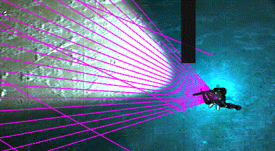
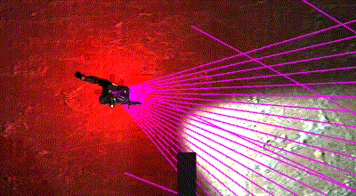

# Mechmania 23
The goal of Mechmania 23 is to score 500 points. Points are obtained by controlling a team of three soldiers to capture three objectives. They can also be gained by killing enemies and picking up score items.

The game's source code and further documentation can be found [here](https://mechmania2017.com/).

## Results
I placed 6th of 40.

## Main Strategy
My main strategy was to use a load-out of three long range character to snipe from afar. Each character is assigned an objective that they are trying to take. As the characters spawn, they approach the objectives from an angle that provides a long line of sight. If they see an enemy, they keep their distance and snipe from a distance. Otherwise they cap the objective and retreat to their designated camping spot. Here they wait for an enemy to come and then snipe then if they try to take the objective.

## Fire Priority
Fire priority for all characters was set to LOWHP. When fighting multiple characters it is important to guarantee kills. Once the first enemy is dead there will be less enemies firing at you and it gives you 5 points.

## Changing Positions
If one of our characters is camping our owned objective and a character next to him dies, the character will be reassigned to the new objective. Also, this can be done simply by exchanging references of the two characters.

## Items
If there character is close to an item, they will go and get it. Close is defined as 40 units for points items and 20 units for other items. If the character is fighting an enemy, capping an objective, or full on health when the item is health, then the character will not try to pick up an item.

## Attacking Enemies
The character will target any enemy that it sees or is attacked by. It targets the enemy by looking at it and then moving to the camping spot to get some distance. The exception is when the character is capping a point they will hold there ground and face the enemy.

## Rotation
If the character is far from the objective (>35 units) or capping the objective they will spin to try to detect any enemies. Otherwise the character looks at its assigned objective. Of course looking at an enemy takes priority over both of these.

## Duck and Cover while Reloading
For each camping spot there is a predetermined duck and cover position. After the character takes a shot the character ducks behind cover while reloading.

## Counter Strategy for Corner Hiders
One strategy others employed was to hide in the corners and either snipe or ambush those who try to take any of the outside objectives. To counteract this, as the character is approaching one of the outside objectives, they look to the corners to detect if anyone is hiding. Additionally, the outside character will spin along the edge when they are not focused of the objective or enemy. If they see someone, they go to a special position on the inside corner of the objective to snipe from as far away as they can. This location also has a designated duck and cover spot.

## Improving Visibility Detection
This last strategy is a little complicated and not obvious at all. Before I describe it I have to explain how the games visibility detection works. Visibility detection is accomplished by tracing rays (20 for long range) and seeing if they collide with another character. You can see these rays in unity if you go to the scene view. However at the end of our range these rays spread out. This allows the possibility for a character to be positioned between the rays without touching them. This effect is worsened due to the fact that there are an even number of rays. Meaning there is no central ray, so if you approach another character head on they will automatically slip into the gap. As demonstrated in this gif.

To prevent this from happening, we can oscillate the character's desired angle to catch a character that would otherwise slip through the gap.

By doing this we are more likely to get the first hit sooner and therefore survive longer. If you look very closely at one of my matches or the first gif you can notice that the vision cone for my characters vibrates when focusing on something.
